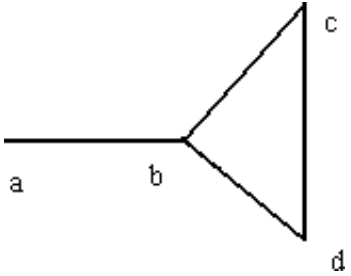
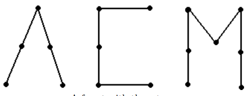
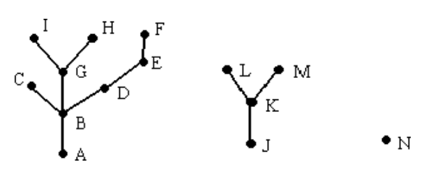

# Act 4.3 - Actividad Integral de Grafos (Evidencia Competencia)

## <span style="color: rgb(26, 99, 169);">¿Qué tengo que hacer?</span>
En este repositorio encontrarás los archivos de entrada, así como las salidas esperadas que podrás usar para probar tu implementación. También encontrarás un archivo "main.cpp". Ahí deberás implementar tu solución. En el archivo deberás colocar en la parte superior, en comentarios, tus datos. Por ejemplo:
```
// =========================================================
// File: main.cpp
// Author: Edward Elric - A00123456
// Date: 01/01/2021
// =========================================================
```
<span style="text-decoration: underline;">De manera individual</span>, desarrolla la solución del siguiente problema:

Un grafo *G* es un conjunto de puntos *V*(*G*), junto con un conjunto de aristas *E*(*G*), donde cada elemento de *E*(*G*) es un par desordenado de puntos distintos de *V*(*G*).

**Ejemplo 1:** Sea *G* un grafo donde *V*(*G*) = {*a*, *b*, *c*, *d*} y *E*(*G*) = {(*a*, *b*),(*b*, *c*),(*c*, *d*),(*d* , *b*)}. La siguiente figura da una representación de *G*.



Note que *G* contiene el "ciclo", {(*b*, *c*),(*c*, *d*),(*d*, *b*)}. Un grafo desprovisto de ciclos se llama árbol. Un camino en un grafo G es una secuencia alterna de puntos y aristas (que comienza y termina con un punto) tal que todos los puntos del camino son distintos. En el grafo del ejemplo 1, {*a*,(*a*, *b*), *b,(*b*, *c*), *c*,(*c*, *d*), *d*} es un camino.

**Hecho:** cada dos puntos de un árbol están unidos por un camino único.

Un grafo se dice conexo si cada par de puntos están unidos por un camino. El grafo del ejemplo 1 está conectado. Si un grafo no es conexo entonces se compone de "subgrafos" que lo son. Cada uno de estos subgrafos se llama componente conexo del grafo G.

Un grafo en el que cada componente conectado es un árbol se llama bosque, véase la figura siguiente.



Un caso extremo que vale la pena mencionar es el caso en que uno de los árboles componentes tiene un punto pero no tiene aristas unidas a él. A este árbol le gusta como un punto aislado. Llamaremos a esto una bellota (acorn). Estamos listos para definir el problema.

**Problema:** dado un bosque, escribe un programa que cuente la cantidad de árboles y bellotas.

## <span style="color: rgb(26, 99, 169);">**Entrada**</span>
La descripción de bosque que consta de dos partes:
1. Una lista de aristas del árbol (una por línea, dada como un par de letras mayúsculas desordenadas delimitadas por una fila de 4 asteriscos).
2. Una lista de puntos en el árbol, (estos se darán en una sola línea con un máximo de 26 correspondientes a las letras mayúsculas, A..Z).

## <span style="color: rgb(26, 99, 169);">**Salida**</span>
Tu programa debe imprimir el número de árboles y el número de bellotas, en una oración, por ejemplo:

```
There are x tree(s) and y acorn(s).
```

donde *x* e *y* son los números de árboles y bellotas, respectivamente.

**Nota:** Un bosque puede no tener árboles y solo bellotas, solo árboles y no tener bellotas, o cualquier cosa intermedia, ¡así que mantén los ojos abiertos y no te pierdas el bosque por los árboles!

Sea *G* el grafo cuyos bordes y puntos están dados por el caso de prueba en la entrada de muestra, la siguiente figura se muestra una representación del mismo.



## <span style="color: rgb(26, 99, 169);">**Ejemplo de entrada**</span>
```
(A,B)
(B,C)
(B,D)
(D,E)
(E,F)
(B,G)
(G,H)
(G,I)
(J,K)
(K,L)
(K,M)
****
A,B,C,D,E,F,G,H,I,J,K,L,M,N
```

## <span style="color: rgb(26, 99, 169);">**Ejemplo de salida**</span>
```
There are 2 tree(s) and 1 acorn(s).
```

Para probar tu implementación, compila tu programa con el comando:
```
g++ -std=c++11 main.cpp -o app
```
Posteriormente, prueba con cada uno de los archivos de entrada de prueba que encontrarás en este repositorio (input1.txt, input2.txt, input3.txt, input4.txt). Los resultados que debes obtener se encuentran en los archivos llamados output1.txt, output1.txt, output1.txt y output1.txt. Para realizar las pruebas, puedes usar las siguientes líneas de código. Por ejemplo, si queremos probar con el archivo de prueba "input1.txt".
```
./app < input1.txt > mysolution1.txt
diff mysolution1.txt output1.txt
```
Si el segundo comando no tenga ninguna salida, sabrás que los resultados que obtuviste son los esperados. 

Por último, realiza una investigación y reflexión en forma individual de la importancia y eficiencia del uso de los diferentes algoritmos de ordenamiento y búsqueda en una situación problema de esta naturaleza, generando un documento llamado **"ReflexAct4.3.pdf"**

## <span style="color: rgb(26, 99, 169);">**¿Bajo qué criterios se evalúa mi evidencia?**</span>

- **80%** - Para cada una de las funcionalidades se evaluará:

    - **Excelente (80%)** - pasa correctamente todos los casos de prueba.
    - **Muy Bien (60%)** - pasa correctamente el 75% de los casos de prueba.
    - **Bien (40%)** - pasa correctamente el 50% de los casos de prueba.
    - **Insuficiente (20%)** - pasa correctamente menos del 50% de los casos de prueba.


- **10%** - El código deberá seguir los lineamientos estipulados en el estándar de codificación: <span class="instructure_file_holder link_holder">[liga_estándar_codificación](estandar.pdf)</span>
- **10%** - Se respetenan los nombres de las funciones en la aplicación.

## <span style="color: rgb(26, 99, 169);">**¿Dónde la entrego?**</span>
Esta actividad forma parte tanto de tu calificación final del curso, así como del portafolio de evidencias de las competencias a desarrollar del curso, por lo que se te pide que en forma individual:
* Realices una entrega de  los archivos correspondientes de los algoritmos de ordenamiento y búsqueda, en la sección correspondiente dentro de esta plataforma, así como el documento de reflexión individual (**ReflexAct4.3.pdf**).
* Generes una carpeta en forma personal llamada **TC1031(Portafolio_Final)** que servirá como preparación para la entrega del portafolio de competencias que se realizará al final del curso, esta carpeta debe contener 5 carpetas:
    * Act1.3 
    * Act2.3
    * Act3.4
    * **Act4.3** - coloca aquí tus archivos que solucionaron la <span style="text-decoration: underline;">actividad 4.3</span> así como el documento de reflexión individual (**ReflexAct4.3.pdf**).
    * Act5.2
